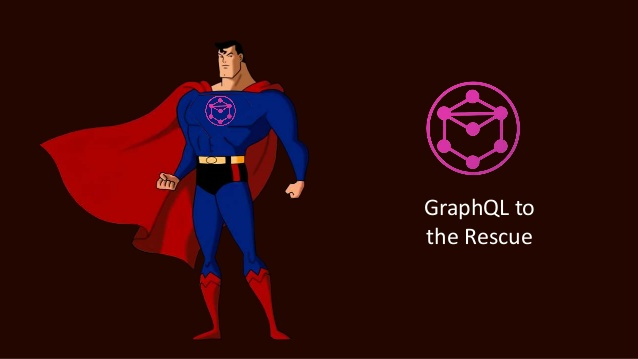

#HSLIDE

# GraphQL Basic

<span class="primary"><strong>Mukesh Purohit</strong></span> - 12 May 2020
 
#HSLIDE

## Challenges with REST

- Multiple Round Trips To Fetch Related Resources.<!-- .element: class="fragment" -->
- Over Fetching / Under Fetching.<!-- .element: class="fragment" -->
- Rapid Product Iterations on the Frontend.<!-- .element: class="fragment" -->

#HSLIDE

## Mukesh to Rescue


#HSLIDE
## GraphQL to Rescue



#HSLIDE

## GraphQL Defination
- GraphQL is a query language for your API, and a server-side runtime for executing queries by using a type system you define for your data <!-- .element: class="fragment" -->
- With GraphQL we describe in the client which data we want to have instead of just asking all the data.<!-- .element: class="fragment" -->

#HSLIDE

## Similarities & Differences:

- Both are based on the concept of a resource and can specify IDs for resources.<!-- .element: class="fragment" -->
- Both can be fetched via an HTTP request.<!-- .element: class="fragment" -->
- Both can return JSON data in the request.<!-- .element: class="fragment" -->

#HSLIDE

## Continuee...

- Data fetching with REST causes over- and under-fetching issues whereas this simply isn’t possible with GraphQL.<!-- .element: class="fragment" -->
- in REST you define the object on Backend and on GraphQL you "define" this object on Frontend.<!-- .element: class="fragment" -->
- With REST, the server determines the shape and size of the resource whereas, in GraphQL, the server simply declares the available resources and the client can ask for exactly what it needs.<!-- .element: class="fragment" -->
- REST automatically puts caching into effect whereas GraphQL has no automatic caching system..<!-- .element: class="fragment" -->

#HSLIDE

## More About GraphQL

- GraphQL is a language that enables you to provide a complete and understandable description of the data in your API.<!-- .element: class="fragment" -->
- GraphQL is declarative: Query responses are decided by the client rather than the server. A GraphQL query returns exactly what a client asks for and no more.<!-- .element: class="fragment" -->
- GraphQL is compositional: A GraphQL query itself is a hierarchical set of fields. The query is shaped just like the data it returns. It is a natural way for product engineers to describe data requirements.<!-- .element: class="fragment" -->
- GraphQL is strongly-typed: A GraphQL query can be ensured to be valid within a GraphQL type system at development time allowing the server to make guarantees about the response. This makes it easier to build high-quality client tools.<!-- .element: class="fragment" -->

#HSLIDE


#HSLIDE

## GraphQL query
```
{
  me {
    name
  }
}

```

## JSON result
```
{
  "data": {
    "me": {
      "name": "Luke Skywalker"
    } 
  }
}
```

#HSLIDE

## Query with parameter
```
{
  human(id: "1000") {
    name
    height
  }
}

```

## JSON result
```
{
  "data": {
    "human"  {
       "name": "Vijay K"
       "height": 5.8
      }
   }
}
```

#HSLIDE
```

{
  "data": {
    "human"  {
       "name": "Vijay K"
       "height": 5.8
      }
   }
}

- No more crazy parsing logic for JSON data.
- No specific endpoints for each client.
- No need for Versioning.
```
#HSLIDE

# Demo

#HSLIDE

# Questions ?

#HSLIDE

# Thank you
